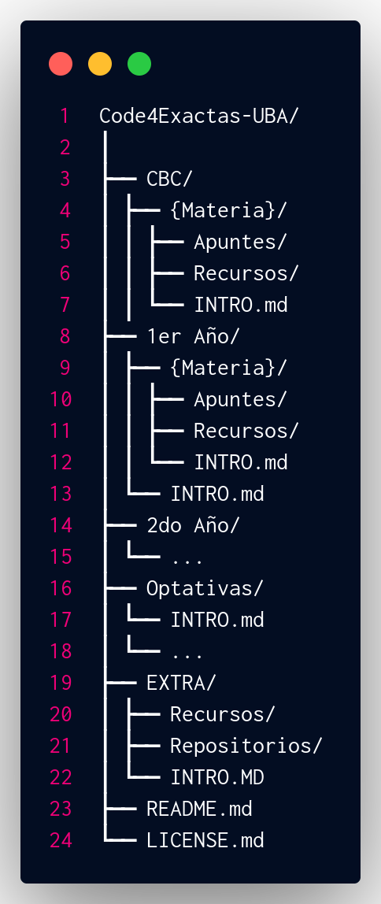

# Code4Exactas-UBA
Repositorio de recursos alternativos y apuntes seleccionados para estudiantes de Cs. de la Computación de la Facultad de Ciencias Exactas y Naturales (FCEN | FCEyN - UBA).

Enfocado principalmente en el plan de estudios 2023, este repositorio proporciona materiales de apoyo organizados por cursada, materia y temas, tanto generales como específicos.

Este repositorio puede ser útil para otras carreras y/o cursadas como Cs. de Datos o CBC
## Estructura del Repositorio

---
## Sobre el Desarrollo del Repositorio

Este repositorio es un proyecto en desarrollo que evolucionará durante mi recorrido por la carrera de Ciencias de la Computación en la FCEN-UBA. El contenido se irá expandiendo gradualmente a medida que avance en mis estudios y adquiera más recursos para compartir.

### Compromiso de Actualización Continua

A pesar de que el repositorio puede parecer escaso en sus etapas iniciales, me comprometo a mantenerlo en constante actualización. La estructura actual sirve como un esqueleto que se irá poblando con contenido valioso a lo largo del tiempo. Cada materia y cada año se nutrirán de nuevos apuntes, recursos y materiales conforme los vaya cursando y recopilando.

### Colaboración y Crecimiento

Invito a todos los estudiantes a ver este proyecto como un recurso vivo y en evolución. Sus contribuciones, sugerencias y retroalimentación serán fundamentales para enriquecer y mejorar este repositorio. En comunidad, podemos construir una valiosa fuente de conocimiento para la comunidad de Ciencias de la Computación en la FCEN-UBA.

### Disclaimer

Como estudiante en las primeras etapas de la carrera, reconozco que algunos de los recursos iniciales podrían requerir revisión o actualización. Agradezco la comprensión y paciencia de todos los usuarios, y animo a aquellos con más experiencia a corregir o complementar la información cuando sea necesario.

---
## Estado Actual y Áreas de Trabajo

Esta sección proporciona información sobre el contenido actual del repositorio y las áreas en las que se está trabajando activamente. Se actualizará regularmente para reflejar el progreso y las prioridades del proyecto.

### En desarrollo activo:
- 🔧 Estructura general del repositorio
- 📚 Contenido para el CBC (Ciclo Básico Común)
	- IPC

### Próximas áreas de enfoque:
- 🔍 Recursos generales para ingresantes
- 📝 Guías de introducción a la carrera

### Planificado para el futuro:
- [x] 1er Año
- [ ] 2do Año
- [ ] Materias Optativas
- [x] Recursos Extra

Última actualización: [27/06/24]

---

Si estás interesado en sugerir o recomendar información para nuevas secciones, no dudes en abrir un issue. Toda sugerencia es bienvenida!

Durante esta etapa inicial los pull requests no se tomaran muy en cuenta debido a la estructura en desarrollo, se espera pronto poder abrir el proyecto a colaboraciones formales.